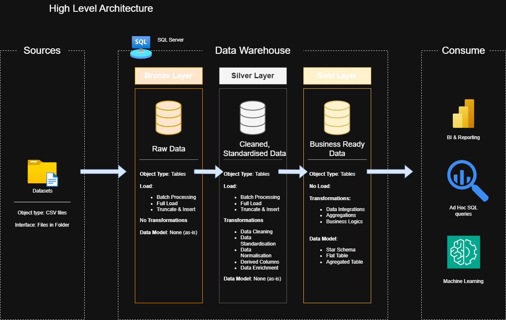

# Independent Data Warehouse and Analytics Project 
This independent project demonstrates the design and implementation of a modern data warehouse using industry-standard ETL workflows and dimensional modeling techniques. The solution follows a Bronze–Silver–Gold (Medallion) architecture and integrates multiple retail data sources sourced from Kaggle to support analytical and reporting use cases.

The project applies best practices learned from industry-focused data engineering workflows, including those popularised by Baraa Khatib Salkini, and adapts them to a custom dataset to simulate a real-world data warehousing scenario.

## Data Architecture

The data architecture for this project follows Medalion Architecture **Bronze**, **Silver**, and **Gold** layers:

1. Bronze Layer: Stores raw data as-is from the source systems. Data is ingested from CSV files into SQL Server Databases.
2. Silver Layer: This layer includes data cleaning, standardisation and normalisation processes to prepare data for analysis
3. Gold Layer: Houses business-ready data modeled into a star schema required for reporting and analytics.
---
## Project Overview

This is an independent portfolio project where I design and implement a modern data warehouse using the Medallion Architecture (Bronze, Silver, and Gold layers).
The project applies real-world data engineering and data modelling techniques to transform raw CSV datasets into analytics-ready tables.

1. Data Architecture: Designing a modern data warehouse using the Medalion Architecture, with clear separation between raw, cleaned and curated data layers.
2. ETL Pipelines: Building ETL workflows to extract, transform and load data from source CSV files into the data warehouse.
3. Data Modeling: Developing fact and dimensional tables optimised for analytical querying and reporting.
4. Analytics & Reporting: Creating SQL based analytical queries to generate business insights such as sales performance, customer behaviour and product trends.

## Purpose of This Project

The goal of this project is to demonstrate practical, job-ready skills in data engineering and analytics by applying industry best practices to a realistic dataset.

This repository showcases experience in:

1. SQL Development
2. Data Warehousing & Data Architecture
3. Data Engineering
4. ETL Pipeline Development
5. Dimensional Data Modeling
6. Analytical Querying & Reporting

## Tools & Technologies

1. SQL (Data definition, Transformation and analytics
2. Git & Github
3. Draw.io (Data Modeling)
4. CSV based source systems
